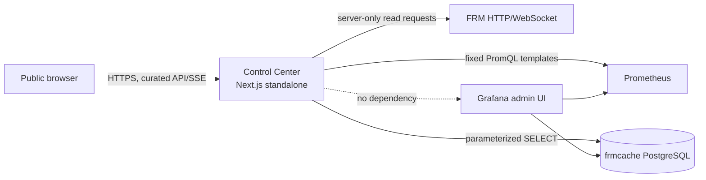
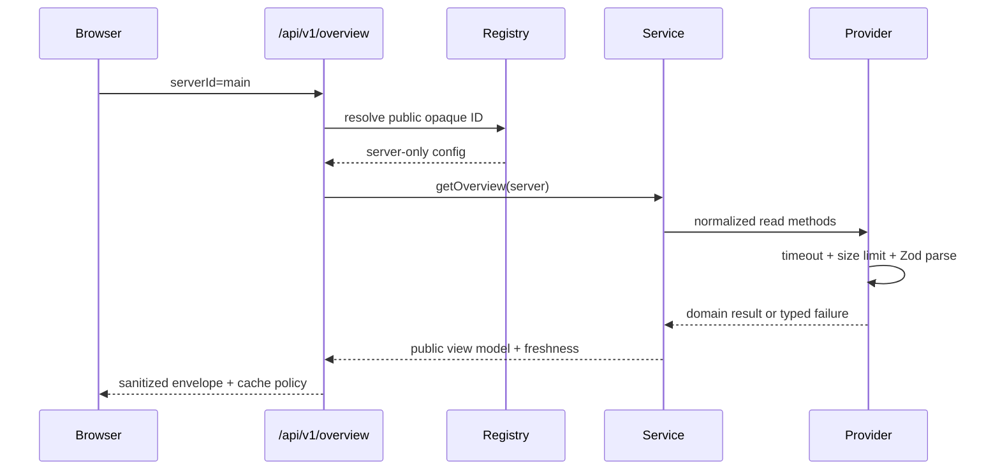

# Architecture review

**Status:** Accepted through Slice 2; later slices remain Planned.<br>
**Reviewed:** 2026-08-18 against FRM upstream commit `32fe64e0c22389a944c27222ef6c881f5e207072`.

## Scope and evidence labels

| Label | Meaning |
|---|---|
| Current/evidenced | Inspected source, documentation, or executed project behavior |
| Reported | Deployment detail supplied by the owner but not probed |
| Planned | Target architecture not yet implemented |
| Assumed | Must be validated against representative deployment data |
| Deferred | Deliberately excluded from the current slice |

Reported infrastructure addresses are configuration examples, not verified service health.

## Decisions

- **Next.js App Router + TypeScript, one standalone image.** It provides one same-origin ingress and keeps all secrets/server integrations out of browser bundles.
- **Node runtime, not Edge.** PostgreSQL, long-lived SSE, and process-local aggregation need Node APIs.
- **Hexagonal adapter boundary.** `FrmProvider`, `MetricsProvider`, and `HistoryProvider` return normalized domain models. Views and public routes never import raw upstream schemas.
- **SSE downstream; FRM WebSocket or polling upstream.** Browser traffic is one-way telemetry, so SSE is simpler, proxy-friendly, and auto-reconnecting. Polling curated endpoints is the fallback. A process-wide aggregator prevents one upstream subscription per browser.
- **Application-defined historical queries.** Metrics providers expose named methods; no arbitrary PromQL. PostgreSQL adapters use fixed parameterized SQL and a SELECT-only role.
- **Opaque multi-server registry.** A request may provide only a configured public `serverId`; hostnames and URLs are never request data.
- **Original map implementation.** FRM documents 58 read endpoints and grants separate web UIs, but no repository license file was present. FRM map code/assets are not copied. Phase A uses an original schematic map over normalized data. Any future reuse requires explicit license evidence and an ADR.

## Context diagram



## Module boundaries

```text
src/app                 routing, server components, route handlers
src/components          presentation primitives and shell
src/features            page-specific view composition
src/domain              normalized game concepts and provider ports
src/contracts           versioned public request/response schemas
src/lib/server/config   validated runtime-only configuration
src/lib/server/adapters upstream-specific parsing and transport
src/lib/server/services orchestration, derivation, cache policy
src/lib/server/security allowlists, rate limits, sanitization, headers
src/lib/server/realtime shared upstream aggregation and SSE fan-out
```

Imports flow inward: `app/features -> services -> domain ports`; adapters implement ports. Domain and contracts do not import Next.js or network/database libraries.

## Request flow



## Configuration and multi-server model

`SERVERS_JSON` is the extensible server registry. For a single server, `DEFAULT_SERVER_ID`, `DEFAULT_SERVER_NAME`, and `FRM_BASE_URL` form one registry entry. URLs are validated at startup, are server-only, and are never serialized publicly. Public entries expose only `{id, displayName}`.

## Caching and reliability

- Timeouts and response-byte limits exist at the adapter transport boundary.
- A short TTL promise cache coalesces concurrent reads.
- The overview response uses `no-store` because it contains player names; the process-local five-second promise cache provides coalescing without shared browser/CDN caching.
- Last-known-good stale serving is Planned and must include explicit observation timestamps.
- Retries are bounded and limited to safe idempotent reads; no retry storms.
- Circuit breaker is Planned after live failure characteristics are observed.
- FRM failure must not disable Prometheus history; Prometheus failure must not disable FRM realtime.

## Realtime

**Implemented for Power:** a Node-process singleton maintains at most one bounded `getPower` polling loop per configured server and publishes strict normalized snapshots. Public same-origin SSE sends an initial snapshot, changed updates, heartbeat comments, and `Cache-Control: no-store, no-transform`; it enforces per-client/global connection limits, bounded event size, and abort cleanup. The browser makes at most two delayed reconnects before falling back to the curated `/api/v1/power` route. `POWER_STREAM_ENABLED` defaults to `false` until the deployment path is explicitly validated. Upstream FRM WebSocket use remains a future private producer option rather than a public tunnel. Horizontal scaling requires an external pub/sub or ownership mechanism; one Unraid replica is the current contract.

## Health semantics

- `/api/health/live`: process can serve HTTP; no upstream check.
- `/api/health/ready`: configuration loaded and application can serve. Upstream degradation is represented in the overview envelope and is not currently probed by readiness.
- `/api/health`: combined sanitized summary.

## Architecture risks and validation gates

1. **Unknown live FRM variance:** capture redacted representative payloads before broad live adapter claims.
2. **FRM authentication/read classification:** use only enumerated read allowlists; never generic forwarding.
3. **Map licensing:** no copied assets/code without explicit permission/license.
4. **Grafana query drift:** inspect provisioned dashboards before implementing each historical vertical slice.
5. **PostgreSQL schema drift:** introspect read-only schema before writing SQL; no migrations against frmcache.
6. **SSE proxy buffering:** validate through the actual reverse proxy/Tunnel, with polling fallback retained.
7. **Process-local cache:** acceptable for one replica; document and redesign before scaling.
8. **Public player privacy:** positions and inventory default independently and are filtered server-side.

## Delivery phases

- **Slice 1:** contracts, mock/live provider boundary, health, public server selector, overview shell, session status, CI/container foundation.
- **Slice 2:** power realtime + fixed Prometheus history.
- **Slice 3:** production/item detail + history.
- **Slice 4:** original normalized map + shared realtime channel.
- **Slices 5–9:** players; storage; factories/bottlenecks; trains/drones; history/progress.

Each slice requires RED/GREEN tests, lint, strict typecheck, build, responsive browser evidence, and docs updates.
